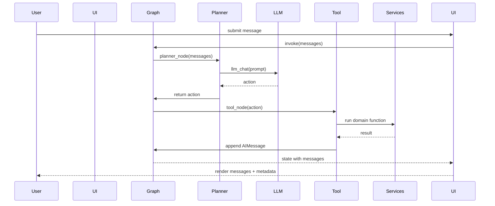
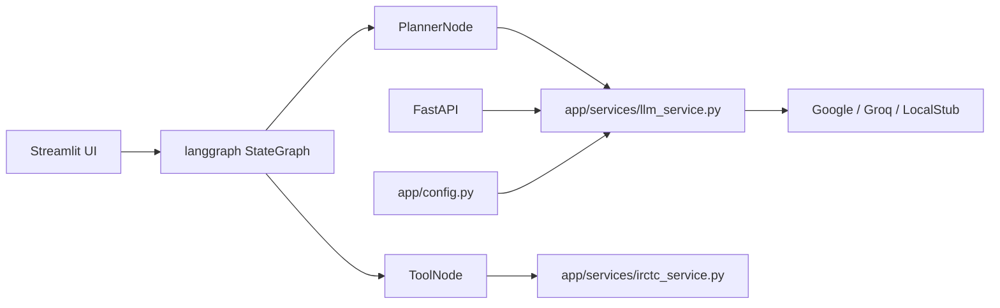

# IRCTC_POC — Architecture & Technical Documentation

This document describes the architecture, components, data flow, and operational details for the IRCTC_POC project. It's written for developers and architects who want a concise, actionable understanding of the system.

---

## 1. 📌 Project Overview

- **Project name:** IRCTC_POC
- **Purpose:** Proof-of-concept conversational assistant for IRCTC-style train queries.
- **Problem it solves:** Receives natural-language user queries about trains and routes, routes requests to simple domain tools or an LLM planner, and returns helpful answers in a chat UI.
- **Target users:** Developers, product stakeholders, and internal demo audiences validating an LLM-driven assistant.
- **High-level workflow summary:** User submits a message via Streamlit or API → planner (LLM) chooses an action → tool executes domain function (search/availability/policy) → assistant message returned and shown in UI with metadata.

---

## 2. 🏗 System Architecture

- **Architecture style:** Layered Monolith (single repo with UI, orchestrator, and tool functions). The design is modular with pluggable LLM provider adapters.
- **Architecture explanation:** The app uses Streamlit for the UI and `langgraph` StateGraph for orchestration. A planner node (LLM) decides the action; a tool node runs local service code. LLM calls are abstracted via an adapter that supports multiple provider interfaces.

### Components

- UI Layer: `app/main.py` (Streamlit) — session state, conversation metadata, chat rendering.
- API Layer: `app/api.py` (FastAPI) — lightweight LLM endpoint.
- Graph Orchestrator: `app/graph` — `builder.py` composes StateGraph; `nodes.py` contains `planner_node` and `tool_node`.
- LLM Adapter: `app/llm/model.py` & `app/services/llm_service.py` — provider selection and robust calling.
- Domain Tools: `app/services/irctc_service.py` — search, availability, cancellation stubs.
- Config: `app/config.py` — env key loading.

### Interaction Flow (summary)

1. Streamlit UI collects user text and appends a structured message with `conversation_id` and `trace_id`.
2. UI invokes the compiled StateGraph with LLM-ready messages.
3. Planner node builds a prompt and calls `llm_chat()` to obtain an action.
4. Tool node executes the matching domain function and appends an `AIMessage`.
5. Graph returns updated messages → UI syncs and renders messages with metadata.

### Request lifecycle (step-by-step)

1. `app/main.py` receives input and creates `HumanMessage` with metadata.
2. `build_graph()` compiles a `StateGraph` (planner -> tool_executor).
3. Planner (`planner_node`) extracts last human message and calls `llm_chat`.
4. `llm_chat` obtains an LLM via `get_llm` and invokes the provider.
5. Planner receives action text and returns it as state.
6. Tool node executes domain logic and appends `AIMessage`.
7. `main.py` maps returned messages to session objects and renders them.

### Mermaid diagrams

Flowchart

```mermaid
flowchart TD
  U[User (Streamlit)] --> UI[Streamlit UI (app/main.py)]
  UI --> Graph[StateGraph (planner -> tool_executor)]
  Graph --> Planner[Planner Node (LLM)]
  Planner -->|action| ToolExecutor[Tool Node]
  ToolExecutor --> Services[IRCTC Services]
  Planner -->|LLM calls| LLM[LLM Providers (Google / Groq / LocalStub)]
  Services --> UI
  API[FastAPI endpoint] -->|calls| LLMService[llm_chat()]
```

Sequence diagram



Component diagram



---

## 3. 📂 Folder & Code Structure Explanation

- `app/` — main package.
  - `main.py` — Streamlit UI entrypoint and session manager.
  - `api.py` — FastAPI LLM endpoint.
  - `config.py` — environment and keys loader.
  - `graph/` — orchestrator; `builder.py` & `nodes.py`.
  - `llm/` — `model.py` provider selector and dev fallback.
  - `services/` — `llm_service.py` (LLM call wrapper) and `irctc_service.py` (domain tools).
  - `prompts/` — prompt templates (currently placeholder).

- `tests/` — pytest tests; `tests/test_llm_service.py` demonstrates mocking patterns.
- `notebook/` — exploratory notebooks.

Responsibilities & connections

- `main.py` -> builds message list and invokes `graph.invoke(...)`.
- `graph/nodes.py` -> planner uses `llm_service` and tool node calls `irctc_service`.
- `llm/model.py` -> selects an LLM provider or local stub.

Design patterns

- Adapter/Strategy: `get_llm` picks a provider implementation.
- Orchestration: `langgraph` StateGraph models planner→tool flow.

---

## 4. 🔄 Data Flow

- **Input:** User text via Streamlit or JSON via `/llm_chat`.
- **Processing:** Planner prompt composition → LLM call → action selection → tool execution.
- **Storage:** In-memory via Streamlit session for POC. `llm_service` can write transcripts to files.
- **Output:** Chat messages in UI; API returns JSON `{text, raw}`.
- **External APIs:** Google GenAI and Groq (if configured); local stub fallback for dev.
- **Error handling:** `llm_chat` uses retries/backoff; `config.py` validates keys (note: raises if missing in current code).

---

## 5. 🧠 Business Logic Explanation

- **Planner:** Examines the last user message and asks an LLM which action to take.
- **Tool Node:** Maps action to `irctc_service` functions and returns results as `AIMessage`.
- **LLM Integration:** `llm_chat` supports multiple interfaces (client.create, generate, callable) and normalizes results.
- **No vector DB or embeddings** in the current codebase.

---

## 6. 🗄 Database Documentation

- **Database:** None present.
- **Recommendation:** Add Postgres for persistence (conversations, transcripts); use SQLAlchemy + asyncpg and a connection pool.

---

## 7. 🔐 Security Architecture

- **Auth:** Not implemented; Streamlit and FastAPI are unprotected.
- **Secrets:** Keys loaded via `.env` and `app/config.py`. Use a secrets manager in production.
- **API protection:** Add API key/OAuth and rate-limiting for production.

---

## 8. 🚀 Deployment Architecture

- **Local run (Streamlit):**
  ```powershell
  cd C:\\Irctc_POC
  streamlit run app/main.py
  ```
- **FastAPI:**
  ```powershell
  uvicorn app.api:app --reload --port 8000
  ```
- **Docker:** No Dockerfile included; typical Dockerfile advice: base python:3.12, install deps, expose port, run streamlit or uvicorn.
- **CI/CD:** Not present; recommend GitHub Actions for lint, tests, build, and deploy.

---

## 9. 📦 Tech Stack Summary

- Python 3.12
- Streamlit (UI)
- FastAPI (API)
- LangChain provider wrappers (Google GenAI / Groq)
- Langgraph (workflow)
- PyTest (tests)

Rationale: quick prototyping (Streamlit), modular LLM adapters (LangChain), and explicit workflow modeling (langgraph).

---

## 10. 📊 Scalability & Optimization

- Convert LLM calls to async where supported.
- Move persistence to a DB and use Redis for caching.
- Separate UI and orchestrator into services for horizontal scaling.

---

## 11. 🧪 Testing Strategy

- Unit tests: use pytest and mocks for `get_llm` (see `tests/test_llm_service.py`).
- Integration tests: FastAPI `TestClient` + mocked LLMs.
- E2E: smoke tests for Streamlit flows (manual or automation).

---

## 12. 📖 API Documentation

- **POST** `/llm_chat`
  - Request JSON:
    ```json
    {"prompt": "string", "provider": "groq"}
    ```
  - Response JSON:
    ```json
    {"text": "parsed text", "raw": { /* provider raw response */ }}
    ```
  - Errors: 500 on LLM failures; see server logs for details.

---

## 13. 📝 README (Clean Version)

### Installation

1. Install Python 3.12 and Poetry (or pip)
2. Install dependencies:

```bash
# using poetry
poetry install

# or using pip (generate requirements.txt first from pyproject.toml)
pip install -r requirements.txt
```

### Environment

Create `.env` with:

```
GOOGLE_API_KEY=<your-google-key>
GROQ_API_KEY=<your-groq-key>
```

For local development without keys, the repo provides a local LLM stub fallback. Note: `app/config.py` currently raises if keys are missing; consider editing `app/config.py` to relax validation for dev.

### Run

Start the Streamlit UI:

```powershell
cd C:\\Irctc_POC
streamlit run app/main.py
```

Start the API (optional):

```powershell
uvicorn app.api:app --reload --port 8000
```

### Troubleshooting

- If you see missing LLM provider errors, either install the required packages or rely on the local stub.
- If `app/config.py` raises about missing keys, add the keys to `.env` or update `config.py` to skip strict checks in dev.

---

## Next Actions (recommended)

1. Persist conversations to a DB and add an export endpoint (JSON/CSV).
2. Protect FastAPI with API keys and secure Streamlit behind auth.
3. Add Dockerfile and CI pipeline for reproducible builds.
4. Add more tests for `graph/nodes.py` (planner and tool execution) and Streamlit component integration.

---

_Document generated from repository scan on 2026-02-21._
